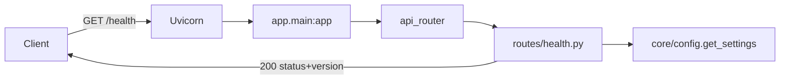

# CLAUDE.md

## Purpose of This File

This file is the operating guide and project memory for future Claude Code sessions
working in this repository. It records what the project actually contains today, how
to set it up, run it, test it, and where to safely extend it — so future sessions do
not have to rediscover the same facts. Everything here is derived from inspecting the
repository at the current commit, not from assumptions about where the project is
headed.

> **Reality check (verified):** This repo is in a **backend foundation / skeleton
> phase**. It ships a FastAPI app with a single `/health` endpoint plus empty "seam"
> modules for the database, Celery worker, and domain layer. **No document parsing,
> OCR, PDF handling, image processing, table extraction, ML/multimodal models,
> validation, confidence scoring, human review, or export exist yet.** Do not
> document or assume those capabilities — they are explicitly out of scope for this
> phase (see [docs/architecture.md](docs/architecture.md) "Out of scope").

## Important Rule for Future Claude Code Sessions

> After every coding task, Claude Code must review whether `CLAUDE.md` needs to be
> updated.
>
> Update `CLAUDE.md` in the same session if any of the following changed:
>
> - Project structure
> - Source file responsibilities
> - Setup or installation steps
> - Dependencies
> - Environment variables
> - Commands
> - Data flow
> - PDF/OCR/document-processing behavior
> - ML/model behavior
> - Input or output formats
> - Tests or validation steps
> - Known issues, assumptions, or risks
>
> If no update is needed, explicitly state at the end of the task:
> `CLAUDE.md was reviewed and remains accurate.`

## Project Overview

- **What it does (today):** Exposes a FastAPI HTTP service with a `GET /health`
  liveness endpoint returning `{"status": "ok", "version": "0.1.0"}`. That is the
  full runtime behavior currently implemented.
- **What it is intended to do (per docs, NOT yet implemented):** Turn invoices and
  contracts (messy PDFs, scans, attachments) into clean, validated, structured data
  with human review and JSON/CSV export. See [description.md](description.md) and
  [problemstilling.md](problemstilling.md) for the intended product vision.
- **Project type:** Python backend service / API (FastAPI), structured as an
  installable `src`-layout package (`document-intelligence`). Async processing
  (Celery) and a database (SQLAlchemy/PostgreSQL) are scaffolded as seams but unused.
- **Key technologies (from [pyproject.toml](pyproject.toml)):** FastAPI, Uvicorn,
  Pydantic v2, pydantic-settings, SQLAlchemy 2.0, psycopg 3, Redis, Celery. Dev:
  pytest, httpx, ruff. Python **3.11+**.
- **High-level architecture:** Layered package under `src/app/` — `api/` (HTTP),
  `core/` (config), `db/` (session seam), `worker/` (Celery seam), `domain/` (empty
  business-logic layer). A `create_app()` factory builds the FastAPI instance.

## Repository Map

| Path | Purpose | Notes for Claude Code |
|---|---|---|
| [pyproject.toml](pyproject.toml) | Package metadata, dependencies (runtime + `dev` extra), pytest & ruff config | Single source of dependency truth. No `requirements.txt`. `pythonpath=["src"]`, `testpaths=["tests"]`, ruff `line-length=100`. |
| [Makefile](Makefile) | Developer commands: `install`, `verify`, `test`, `run`, `lint` | Primary command entrypoint. `run` target uses `app.main:app` (works because src is on the path via editable install). |
| [.python-version](.python-version) | Python floor: `3.11` | Matches `requires-python>=3.11`. |
| [.env.example](.env.example) | Config template (copy to `.env` — **required**) | Documents all settings. `DATABASE_URL`/`REDIS_URL` are **required** (no default); the rest have defaults. |
| [.gitignore](.gitignore) | Ignores venvs, caches, secrets, `storage/*` contents | `storage/.gitkeep` is kept; `.env.example` is kept, real `.env` ignored. |
| [README.md](README.md) | Human setup/run guide | Accurate and current; mirrors this file. |
| [description.md](description.md) / [problemstilling.md](problemstilling.md) | Product vision & problem statement | Aspirational — describes features **not yet built**. |
| [docs/architecture.md](docs/architecture.md) | Layer/seam documentation | Authoritative on intent vs. scope; lists out-of-scope features. |
| [scripts/verify_env.py](scripts/verify_env.py) | Checks Python version + imports of all core deps | Run by `make verify` before pytest. Fails fast, non-zero on first missing dep. |
| [src/app/main.py](src/app/main.py) | FastAPI entrypoint; `create_app()` factory + module-level `app` | App is built as `app.main:app`. Settings load eagerly here. |
| [src/app/__init__.py](src/app/__init__.py) | Package init; defines `__version__ = "0.1.0"` | Single source of the version string used by config and health. |
| [src/app/core/config.py](src/app/core/config.py) | `Settings` (pydantic-settings) + cached `get_settings()` | Reads `.env`; `extra="ignore"`. Central config for API, worker, and DB. Fields: `app_title`, `app_version`, `app_env`, **required** `database_url`/`redis_url`, `storage_path`, `worker_concurrency` (int, `ge=1`), `worker_queue_name`. Add new settings here. |
| [src/app/api/router.py](src/app/api/router.py) | Aggregates feature routers into `api_router` | Mount new routers here (documents, extraction, review, export). |
| [src/app/api/routes/health.py](src/app/api/routes/health.py) | `GET /health` route + `HealthResponse` model | Only implemented endpoint. Intentionally no DB/Redis access. |
| [src/app/db/session.py](src/app/db/session.py) | Lazy SQLAlchemy 2.0 engine/sessionmaker seam | **Unused at runtime.** No models/migrations exist. Reads `database_url` from `get_settings()` (not `os.environ`) inside `get_engine()`, so import stays non-connecting; connects only when first called. |
| [src/app/worker/celery_app.py](src/app/worker/celery_app.py) | Celery app against Redis broker/backend | **Seam only** — no tasks registered, no worker started. Sources `redis_url`, `worker_queue_name`, `worker_concurrency` from `get_settings()` at import (constructs `Settings`; does not connect to Redis). |
| [src/app/domain/__init__.py](src/app/domain/__init__.py) | Business-entity layer | **Empty** placeholder for invoices/contracts/validation logic. |
| [tests/conftest.py](tests/conftest.py) | `client` fixture + autouse `_required_config` fixture | Sets test `DATABASE_URL`/`REDIS_URL` (module-level `setdefault` before importing `app.main`, plus per-test `monkeypatch`) and clears the `get_settings` cache so the suite is hermetic and secret-free. Builds a fresh app per test via `create_app()`. |
| [tests/test_health.py](tests/test_health.py) | Test for `/health` | Liveness test. |
| [tests/test_config.py](tests/test_config.py) | Tests for `Settings` | Covers defaults, env overrides, missing-required `ValidationError`, and `worker_concurrency` constraint. |
| [storage/](storage/) | Upload-storage seam; contents git-ignored | Only `.gitkeep` tracked. No upload code yet. |
| [migrations/](migrations/) | DB migrations seam | Only `.gitkeep`. No migration tool configured. |
| `src/document_intelligence.egg-info/` | Generated editable-install metadata | **Generated artifact** — do not hand-edit; regenerated by `pip install -e`. |

## Core Architecture and Data Flow

Current runtime flow is minimal — a single request path:



- **Input/entry:** HTTP request to the FastAPI app (`app.main:app`), served by
  Uvicorn. The only route is `GET /health`.
- **Processing:** `health()` reads cached settings and returns status + version. No
  database, Redis, file, or external access occurs.
- **Output format:** JSON `{"status": "ok", "version": "0.1.0"}`, HTTP 200.
- **Startup:** `create_app()` eagerly calls `get_settings()`, so a malformed
  environment fails fast at startup with a `pydantic.ValidationError`.
- **Document/OCR/ML flow:** **None exists.** The `domain/`, `db/`, and `worker/`
  layers are seams with no business logic. Any document-processing pipeline is
  future work and would live primarily in `domain/` (logic), `worker/` (async
  tasks), `db/` (persistence), and new `api/routes/` modules (endpoints).

## Main Components

| Component | Location | Responsibility | Inputs | Outputs | Safe Modification Notes |
|---|---|---|---|---|---|
| `create_app()` / `app` | [src/app/main.py](src/app/main.py) | Build & configure FastAPI; mount `api_router` | Settings | Configured `FastAPI` instance | Keep the factory pattern (tests rely on `create_app()`). Register new routers via `api_router`, not directly here. |
| `Settings` / `get_settings()` | [src/app/core/config.py](src/app/core/config.py) | Typed, cached app configuration for API, worker, and DB | Env vars / `.env` | `Settings` object | `database_url`/`redis_url` are **required** (missing → `ValidationError` at startup). `get_settings()` is `lru_cache`d — changing env at runtime won't re-read (call `cache_clear()` in tests). Add config fields here. `extra="ignore"` tolerates unknown env keys. |
| `api_router` | [src/app/api/router.py](src/app/api/router.py) | Aggregate feature routers | Feature routers | Mounted `APIRouter` | This is the single place to wire new endpoint modules. |
| `health()` / `HealthResponse` | [src/app/api/routes/health.py](src/app/api/routes/health.py) | Liveness probe | None | JSON status+version | Keep it dependency-free (no DB/Redis) so it stays a fast liveness check. |
| `get_engine()` / `get_sessionmaker()` | [src/app/db/session.py](src/app/db/session.py) | Lazy DB engine/session factory | `get_settings().database_url` | SQLAlchemy `Engine` / `sessionmaker` | Lazy + `lru_cache`d so nothing connects at import. Reads the URL from `Settings`. Wire up only alongside real models/migrations. |
| `celery_app` | [src/app/worker/celery_app.py](src/app/worker/celery_app.py) | Celery app (Redis broker/backend) | `get_settings()` (`redis_url`, worker settings) | `Celery` instance | Broker/backend + `task_default_queue`/`worker_concurrency` come from `Settings`. No tasks yet. Add tasks + autodiscovery when async processing is needed. |
| `verify_env` | [scripts/verify_env.py](scripts/verify_env.py) | Validate Python version + dep imports | Running interpreter | Console report; exit code | Keep `CORE_MODULES` in sync with `pyproject.toml` dependencies. |

## Setup and Environment

Confirmed from [README.md](README.md), [Makefile](Makefile), [pyproject.toml](pyproject.toml):

- **Python:** 3.11+ required (`.python-version` = `3.11`, `requires-python>=3.11`).
- **Install (editable, with dev tools):**
  ```bash
  python -m venv .venv
  source .venv/bin/activate        # Windows: .venv\Scripts\activate
  pip install -e ".[dev]"          # or: make install
  ```
- **Required config:** `cp .env.example .env`. `DATABASE_URL` and `REDIS_URL` are
  **required** (no default) — the app fails fast at startup with a
  `pydantic.ValidationError` if they are missing, so `.env` is now mandatory to run
  the app. All other settings have safe local defaults. (Tests supply the required
  values via the `conftest.py` autouse fixture, not a committed `.env`.)
- **System packages / external tools:** None strictly required to run `/health`.
  `psycopg[binary]`, `redis`, and `celery` are installed as dependencies but their
  backing services (PostgreSQL, Redis) are **not** needed this phase because nothing
  connects to them. `Needs verification:` no Dockerfile, docker-compose, or CI config
  is present, so a Postgres/Redis runtime is not provisioned by the repo.
- **Models / APIs / API keys:** None. No ML model, LLM, OCR engine, or external API
  is referenced anywhere in the code.
- **Environment variables (all read centrally via `Settings`):**
  - `APP_TITLE` (default `"Document Intelligence API"`)
  - `APP_ENV` (default `"local"`)
  - `APP_VERSION` (default `__version__`; normally left unset)
  - `DATABASE_URL` — **required** (no default). Read by `Settings`; used by
    `db/session.py`'s `get_engine()` when first called (still non-connecting at import).
  - `REDIS_URL` — **required** (no default). Read by `Settings`; used by
    `worker/celery_app.py` at import (constructs `Settings`; no worker runs, no Redis
    connection).
  - `STORAGE_PATH` (default `"storage"`) — local upload-storage seam path.
  - `WORKER_CONCURRENCY` (default `1`, int `ge=1`) — applied to `celery_app.conf`.
  - `WORKER_QUEUE_NAME` (default `"document_intelligence"`) — applied to `celery_app.conf`.

## Running the Project

- **Run the API (auto-reload):**
  ```bash
  make run                          # or: uvicorn app.main:app --reload
  ```
  Note the import path is `app.main:app` (the package is `app`, installed from
  `src/` via the editable install). Serves on `http://127.0.0.1:8000` by default.
- **Interactive docs:** `http://127.0.0.1:8000/docs`
- **Health check:**
  ```bash
  curl -i http://127.0.0.1:8000/health
  # -> 200 {"status":"ok","version":"0.1.0"}
  ```
- **Verify environment + tests:**
  ```bash
  make verify                       # python scripts/verify_env.py && pytest -q
  ```
- **Lint:**
  ```bash
  make lint                         # ruff check src tests
  ```
- **No CLI, notebook, demo, or worker entrypoint exists.** There is no command to
  upload or process a document because that functionality is not built.

## Testing and Validation

- **Framework:** pytest (config in [pyproject.toml](pyproject.toml):
  `pythonpath=["src"]`, `testpaths=["tests"]`).
- **Location:** [tests/](tests/) — `conftest.py` (TestClient `client` fixture +
  autouse `_required_config` fixture that injects test `DATABASE_URL`/`REDIS_URL`),
  `test_health.py`, and `test_config.py`.
- **Run tests:**
  ```bash
  make test                         # or: pytest -q
  ```
- **Validation workflow:** `make verify` first checks Python version and that all
  core deps import ([scripts/verify_env.py](scripts/verify_env.py)), then runs pytest.
- **Coverage gaps:** Only `/health` and the `Settings` config are tested. There are
  **no** document, OCR, PDF, image, model, validation, or export tests because those
  features do not exist.
  When adding features, add tests under `tests/` mirroring the `src/app/` structure
  (e.g. `tests/test_<feature>.py`), reusing the `client` fixture for endpoints.

## Development Guidelines

Observed conventions (follow them for consistency):

- **Style:** Every module starts with a descriptive docstring; `from __future__
  import annotations` at the top; type hints throughout; ruff with `line-length=100`.
  Run `make lint` before finishing.
- **Naming:** snake_case modules/functions, PascalCase Pydantic models/classes,
  lower_snake settings fields.
- **File organization (where to add things):**
  - New HTTP endpoints → add a module under `src/app/api/routes/`, then include its
    `router` in [src/app/api/router.py](src/app/api/router.py).
  - New config/settings → fields on `Settings` in
    [src/app/core/config.py](src/app/core/config.py).
  - Business/domain logic (invoice/contract entities, validation, confidence,
    review) → [src/app/domain/](src/app/domain/) (currently empty).
  - DB models/persistence → build on [src/app/db/session.py](src/app/db/session.py);
    add a real migrations setup under [migrations/](migrations/).
  - Async/background tasks → register on `celery_app` in
    [src/app/worker/celery_app.py](src/app/worker/celery_app.py).
- **Where NOT to add code:** Don't put endpoint logic directly in `main.py`; don't
  hand-edit `src/document_intelligence.egg-info/` (generated); don't commit anything
  into `storage/` (git-ignored seam) or real `.env` files/secrets.
- **Compatibility:** Preserve the `create_app()` factory and the `app.main:app`
  import path (tests, Makefile, and docs depend on them). Keep `/health` free of
  external dependencies. Keep `__version__` in
  [src/app/__init__.py](src/app/__init__.py) as the single version source (config and
  health read from it; bump `version` in `pyproject.toml` to match on release).
- **Dependencies:** Add to `pyproject.toml` (and `verify_env.py`'s `CORE_MODULES` if
  it's a core runtime dep). There is no `requirements.txt` to update.
- **Generated/large artifacts, datasets, models, secrets:** None present today. When
  introduced, keep them out of git (extend `.gitignore`), store uploads under
  `storage/`, and never commit secrets — load via env/`.env`.

## Known Issues, Risks, and Fragile Areas

- **Skeleton only:** The product description ([description.md](description.md)) and
  problem statement ([problemstilling.md](problemstilling.md)) describe a full
  document-intelligence pipeline that is **entirely unimplemented**. Treat those as
  intent, not current behavior.
- **Unused seams that can mislead:**
  - [src/app/db/session.py](src/app/db/session.py) — no models, no migrations; will
    attempt a real connection only if `get_engine()`/`get_sessionmaker()` is called.
  - [src/app/worker/celery_app.py](src/app/worker/celery_app.py) — defines a Celery
    app but registers no tasks and starts no worker; importing it now constructs
    `Settings` (so `DATABASE_URL`/`REDIS_URL` must be present) but does not connect to
    Redis.
  - [src/app/domain/](src/app/domain/) — empty.
- **Required connection strings (no defaults):** `DATABASE_URL` and `REDIS_URL` are
  required by `Settings`; a missing value fails fast at startup with a clear
  `pydantic.ValidationError`. `.env.example` ships credential-free localhost values as
  documented local defaults; set real URLs per environment in the untracked `.env`.
- **Cached settings:** `get_settings()` and the `db` factories are `lru_cache`d —
  environment changes within a running process are not picked up.
- **No CI / containerization:** `Needs verification:` no Dockerfile,
  docker-compose, or CI workflow exists; environment provisioning is manual.
- **`.pytest_cache/` is committed in the working tree** but git-ignored — it is a
  cache artifact; do not rely on or edit it.
- **No OCR/PDF/ML fragility to worry about yet** — because none of that code exists.
  Re-evaluate this section as soon as a real pipeline is added.

## Quick Reference for Future Claude Code Sessions

- **Read first:** [README.md](README.md) → [docs/architecture.md](docs/architecture.md)
  → [pyproject.toml](pyproject.toml) → [src/app/main.py](src/app/main.py) →
  [src/app/api/router.py](src/app/api/router.py).
- **Common commands:**
  - Install: `make install` (`pip install -e ".[dev]"`)
  - Verify env + tests: `make verify`
  - Run API: `make run` (`uvicorn app.main:app --reload`)
  - Tests: `make test` (`pytest -q`)
  - Lint: `make lint` (`ruff check src tests`)
- **Common edit locations:** new endpoint → `src/app/api/routes/` + register in
  `api/router.py`; new setting → `core/config.py`; domain logic → `domain/`.
- **Debugging locations:** startup/config failures → `core/config.py` +
  `main.py` (eager settings load); request issues → `api/routes/health.py`;
  dependency/import problems → run `python scripts/verify_env.py`.
- **High-risk / load-bearing files:** [src/app/main.py](src/app/main.py)
  (`create_app`/`app` contract), [src/app/__init__.py](src/app/__init__.py)
  (`__version__`), [pyproject.toml](pyproject.toml) (deps + tooling config).
- **Validation checklist before finishing a task:**
  1. `make verify` passes (env check + tests green).
  2. `make lint` is clean (ruff, line-length 100).
  3. `/health` still returns `200 {"status":"ok","version":...}` and stays
     dependency-free.
  4. New endpoints are mounted via `api/router.py`; new tests added under `tests/`.
  5. `create_app()` factory and `app.main:app` import path unchanged.
  6. This `CLAUDE.md` reviewed/updated, or state it remains accurate.
```
