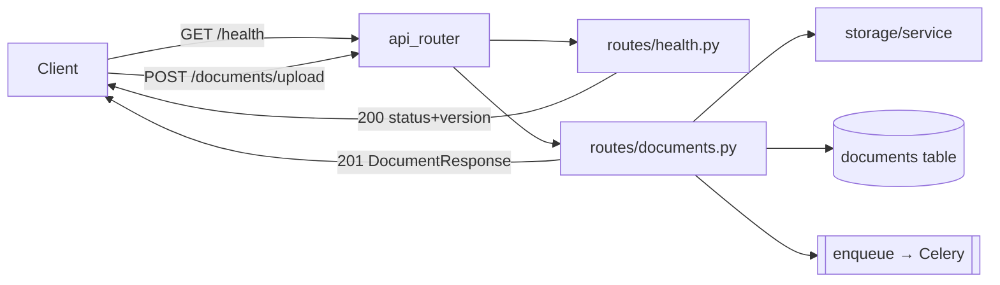

# CLAUDE.md

## Purpose of This File

This file is the operating guide and project memory for future Claude Code sessions
working in this repository. It records what the project actually contains today, how
to set it up, run it, test it, and where to safely extend it — so future sessions do
not have to rediscover the same facts. Everything here is derived from inspecting the
repository at the current commit, not from assumptions about where the project is
headed.

> **Reality check (verified):** This repo is in a **backend foundation phase**. It
> ships a FastAPI app with `/health` **and a first feature slice** —
> `POST /documents/upload` (validate MIME → store original → persist metadata →
> enqueue a placeholder Celery task → `201`). It has a **now-wired** database
> connection layer (lazy engine, `get_db_session` dependency used by the upload
> route, `check_database_connection` probe), a `Document` ORM model + **Alembic**
> revision `0002_add_documents`, a **local document-storage** layout
> (`originals/`/`extracted/`/`exports/`) with safe-path helpers, and a Celery app
> with one registered placeholder task (`process_document`) plus a best-effort
> `enqueue` helper. **No document parsing, OCR, PDF handling, image processing, table
> extraction, ML/multimodal models, validation, confidence scoring, human review, or
> export exist yet** — the worker task is a no-op and `document_type` is always
> `unknown`. Do not document or assume those capabilities — they are explicitly out
> of scope for this phase (see [docs/architecture.md](docs/architecture.md) "Out of
> scope").

## Important Rule for Future Claude Code Sessions

> After every coding task, Claude Code must review whether `CLAUDE.md` needs to be
> updated.
>
> Update `CLAUDE.md` in the same session if any of the following changed:
>
> - Project structure
> - Source file responsibilities
> - Setup or installation steps
> - Dependencies
> - Environment variables
> - Commands
> - Data flow
> - PDF/OCR/document-processing behavior
> - ML/model behavior
> - Input or output formats
> - Tests or validation steps
> - Known issues, assumptions, or risks
>
> If no update is needed, explicitly state at the end of the task:
> `CLAUDE.md was reviewed and remains accurate.`

## Project Overview

- **What it does (today):** Exposes a FastAPI HTTP service with a `GET /health`
  liveness endpoint and a `POST /documents/upload` endpoint that validates a file's
  MIME type, stores the original under local storage, persists metadata to the
  `documents` table, enqueues a placeholder Celery task, and returns `201`. That is
  the full runtime behavior currently implemented.
- **What it is intended to do (per docs, NOT yet implemented):** Turn invoices and
  contracts (messy PDFs, scans, attachments) into clean, validated, structured data
  with human review and JSON/CSV export. See [description.md](description.md) and
  [problemstilling.md](problemstilling.md) for the intended product vision.
- **Project type:** Python backend service / API (FastAPI), structured as an
  installable `src`-layout package (`document-intelligence`). A database
  (SQLAlchemy/PostgreSQL + Alembic) and local storage exist as tested foundations but
  are not yet wired into any request path; async processing (Celery) is still a seam.
- **Key technologies (from [pyproject.toml](pyproject.toml)):** FastAPI,
  python-multipart (multipart upload parsing), Uvicorn, Pydantic v2,
  pydantic-settings, SQLAlchemy 2.0, Alembic, psycopg 3, Redis, Celery. Dev: pytest,
  httpx, ruff. Python **3.11+**.
- **High-level architecture:** Layered package under `src/app/` — `api/` (HTTP),
  `core/` (config), `db/` (lazy session + connectivity + declarative `Base`),
  `storage/` (local file layout + safe paths), `worker/` (Celery seam), `domain/`
  (empty business-logic layer). Migrations live under `migrations/` (Alembic). A
  `create_app()` factory builds the FastAPI instance.

## Repository Map

| Path | Purpose | Notes for Claude Code |
|---|---|---|
| [pyproject.toml](pyproject.toml) | Package metadata, dependencies (runtime + `dev` extra), pytest & ruff config | Single source of dependency truth. No `requirements.txt`. `pythonpath=["src"]`, `testpaths=["tests"]`, ruff `line-length=100`. |
| [Makefile](Makefile) | Developer commands: `install`, `verify`, `test`, `run`, `lint`, `db-check`, `migrate`, `migrate-down`, `migration-create`, `storage-init` | Primary command entrypoint. `run` target uses `app.main:app` (works because src is on the path via editable install). |
| [.python-version](.python-version) | Python floor: `3.11` | Matches `requires-python>=3.11`. |
| [.env.example](.env.example) | Config template (copy to `.env` — **required**) | Documents all settings. `DATABASE_URL`/`REDIS_URL` are **required** (no default); the rest have defaults. |
| [.gitignore](.gitignore) | Ignores venvs, caches, secrets, `storage/**` contents | Keeps `storage/.gitkeep` + per-subdir `.gitkeep` (`originals`/`extracted`/`exports`); `.env.example` kept, real `.env` ignored. |
| [alembic.ini](alembic.ini) | Alembic config (`script_location=migrations`, `prepend_sys_path=src`, `path_separator=os`) | `sqlalchemy.url` intentionally **blank** — the URL is injected from `Settings` in `migrations/env.py`. Never put credentials here. |
| [README.md](README.md) | Human setup/run guide | Accurate and current; mirrors this file. |
| [description.md](description.md) / [problemstilling.md](problemstilling.md) | Product vision & problem statement | Aspirational — describes features **not yet built**. |
| [docs/architecture.md](docs/architecture.md) | Layer/seam documentation | Authoritative on intent vs. scope; lists out-of-scope features. |
| [scripts/verify_env.py](scripts/verify_env.py) | Checks Python version + imports of all core deps | Run by `make verify` before pytest. Fails fast, non-zero on first missing dep. `CORE_MODULES` includes `alembic` and `multipart` (python-multipart). |
| [scripts/check_db.py](scripts/check_db.py) | Local DB connectivity check (`make db-check`) | Standalone operator tool; **not** imported by the app. Calls `check_database_connection()`, exits `0`/`1`, hides credentials in logs. Needs a reachable Postgres. |
| [src/app/main.py](src/app/main.py) | FastAPI entrypoint; `create_app()` factory + module-level `app` | App is built as `app.main:app`. Settings load eagerly here. |
| [src/app/__init__.py](src/app/__init__.py) | Package init; defines `__version__ = "0.1.0"` | Single source of the version string used by config and health. |
| [src/app/core/config.py](src/app/core/config.py) | `Settings` (pydantic-settings) + cached `get_settings()` | Reads `.env`; `extra="ignore"`. Central config for API, worker, and DB. Fields: `app_title`, `app_version`, `app_env`, **required** `database_url`/`redis_url`, `storage_path`, `worker_concurrency` (int, `ge=1`), `worker_queue_name`. Add new settings here. |
| [src/app/api/router.py](src/app/api/router.py) | Aggregates feature routers into `api_router` | Includes `health` and `documents`. Mount new routers here (extraction, review, export). |
| [src/app/api/routes/health.py](src/app/api/routes/health.py) | `GET /health` route + `HealthResponse` model | Liveness endpoint. Intentionally no DB/Redis access. |
| [src/app/api/routes/documents.py](src/app/api/routes/documents.py) | `POST /documents/upload` route + `ALLOWED_CONTENT_TYPES` | Validate MIME → store original → persist `Document` → enqueue → `201 DocumentResponse`. Uses `Depends(get_db_session)`, storage helpers, `enqueue_document_processing`. No parsing/OCR; `document_type` hard-set to `unknown`. |
| [src/app/domain/documents.py](src/app/domain/documents.py) | `DocumentType`/`DocumentStatus` enums + `DocumentResponse` (Pydantic) | DB-free domain types. `str, Enum` values; `DocumentResponse` has `from_attributes=True`. |
| [src/app/db/models.py](src/app/db/models.py) | `Document` ORM model (`documents` table) | `Mapped`/`mapped_column` cols; `Uuid` PK (`uuid4`), `String` enum cols, tz-aware `upload_timestamp` (app-side default), `status` indexed. |
| [src/app/worker/tasks.py](src/app/worker/tasks.py) | Placeholder Celery task `process_document` | No-op: logs START/COMPLETE, returns the id. Registered via `celery_app`'s `include`. |
| [src/app/worker/enqueue.py](src/app/worker/enqueue.py) | `enqueue_document_processing()` helper | Best-effort `.delay()` wrapped in try/except (broker outage must not 500 an upload). Decouples the route from Celery. |
| [src/app/db/session.py](src/app/db/session.py) | Lazy SQLAlchemy 2.0 engine/sessionmaker + `get_db_session()` dependency + `check_database_connection()` | **Not wired into any route yet.** Reads `database_url` from `get_settings()` inside `get_engine()` (import stays non-connecting; connects only when first called). `get_engine()` uses `pool_pre_ping=True`. `check_database_connection()` runs `SELECT 1`, returns bool, logs failures with the **password-hidden** URL. |
| [src/app/db/base.py](src/app/db/base.py) | Declarative `Base` (SQLAlchemy `DeclarativeBase`) | Single base for models; `Base.metadata` is Alembic's `target_metadata`. Models (`Document`) live in `db/models.py`. |
| [migrations/env.py](migrations/env.py) | Alembic runtime env | Injects the DB URL from `get_settings()` via `config.set_main_option(...)`; imports `app.db.models` so `Base.metadata` is populated; `target_metadata = Base.metadata`. Reads settings only when Alembic runs — never at app import. |
| `migrations/versions/0001_initial_empty.py` | Initial empty baseline revision | `down_revision = None`, empty `upgrade`/`downgrade`. The committed base; `versions/.gitkeep` keeps the dir tracked. |
| `migrations/versions/0002_add_documents.py` | Creates the `documents` table | `down_revision = "0001_initial_empty"`. Hand-written `create_table` + `ix_documents_status`; downgrade drops both. Enum cols are plain `String` (no `CREATE TYPE`). |
| [src/app/storage/service.py](src/app/storage/service.py) | Local storage layout + safe-path helpers | `get_storage_root()` (from `Settings.storage_path`), `ensure_storage_layout()` (creates `originals`/`extracted`/`exports`, idempotent — the **only** dir-creating function), `safe_filename()` (basename + whitelist + UUID prefix), `resolve_within_storage()` (traversal-proof via `is_relative_to`). No filesystem work at import. |
| [src/app/storage/__init__.py](src/app/storage/__init__.py) | Storage package public API | Re-exports the `service.py` helpers. |
| [src/app/worker/celery_app.py](src/app/worker/celery_app.py) | Celery app against Redis broker/backend | `include=["app.worker.tasks"]` registers the placeholder task at worker startup. Sources `redis_url`, `worker_queue_name`, `worker_concurrency` from `get_settings()` at import (constructs `Settings`; does not connect to Redis). |
| [src/app/domain/__init__.py](src/app/domain/__init__.py) | Business-entity layer | Package init. Document enums/schema live in `domain/documents.py`; invoice/contract validation logic is still future work. |
| [tests/conftest.py](tests/conftest.py) | `client` fixture + autouse `_required_config` fixture | Sets test `DATABASE_URL`/`REDIS_URL` (module-level `setdefault` before importing `app.main`, plus per-test `monkeypatch`) and clears the `get_settings` cache so the suite is hermetic and secret-free. Builds a fresh app per test via `create_app()`. |
| [tests/test_health.py](tests/test_health.py) | Test for `/health` | Liveness test. |
| [tests/test_config.py](tests/test_config.py) | Tests for `Settings` | Covers defaults, env overrides, missing-required `ValidationError`, and `worker_concurrency` constraint. |
| [tests/test_db_session.py](tests/test_db_session.py) | Tests for the DB session seam (ID 4.1) | sqlite in-memory + unreachable URL; covers engine URL, `get_db_session` yield/close, connectivity success/failure, and password-free failure logging. Clears the lazy caches per test. |
| [tests/test_migrations.py](tests/test_migrations.py) | Tests for Alembic scaffolding (IDs 4.2 / 5.1) | DB-free/static: config loads, `env.py` uses `get_settings`/`set_main_option`, base `0001_initial_empty`, and `0002_add_documents` chained to it as the single head. |
| [tests/test_storage.py](tests/test_storage.py) | Tests for storage layout (ID 6.1) | `tmp_path` + `STORAGE_PATH`; covers root, subdir creation/idempotency, filename sanitising, and traversal rejection. |
| [tests/test_documents.py](tests/test_documents.py) | Tests for model/schema/upload (IDs 5.1/5.2) | sqlite `StaticPool` + `get_db_session` override, `STORAGE_PATH=tmp_path`, monkeypatched enqueue spy. Covers `201` for PDF/text, `415`/`422`, unsafe filename, on-disk storage, and `DocumentResponse` from ORM. |
| [tests/test_worker.py](tests/test_worker.py) | Tests for worker baseline (ID 7.1) | Celery eager mode + `caplog`: task returns id and logs START/COMPLETE; enqueue runs eagerly and swallows a simulated broker error. No real Redis. |
| [storage/](storage/) | Local document storage; contents git-ignored | Subdirs `originals/`, `extracted/`, `exports/` each tracked via `.gitkeep`; created at runtime by `ensure_storage_layout()` / `make storage-init`. |
| [migrations/](migrations/) | Alembic migration environment | `env.py`, `script.py.mako`, `versions/` (initial revision + `.gitkeep`). Committed; requires a reachable DB only to *run*. |
| `src/document_intelligence.egg-info/` | Generated editable-install metadata | **Generated artifact** — do not hand-edit; regenerated by `pip install -e`. |

## Core Architecture and Data Flow

Current runtime flow is minimal — a single request path:



- **Input/entry:** HTTP requests to the FastAPI app (`app.main:app`), served by
  Uvicorn. Routes: `GET /health` and `POST /documents/upload`.
- **Processing:** `health()` reads cached settings and returns status + version (no
  external access). `upload_document()` validates MIME, stores the file, persists a
  `Document`, and enqueues the placeholder task.
- **Output format:** `/health` → JSON `{"status": "ok", "version": "0.1.0"}`, HTTP
  200. `/documents/upload` → `DocumentResponse` JSON, HTTP 201.
- **Startup:** `create_app()` eagerly calls `get_settings()`, so a malformed
  environment fails fast at startup with a `pydantic.ValidationError`.
- **Upload flow (`POST /documents/upload`):** validate MIME against
  `ALLOWED_CONTENT_TYPES` (`415` on mismatch) → `ensure_storage_layout()` →
  `resolve_within_storage("originals", …)` → write bytes (`500` on `OSError`) →
  insert a `Document` row via `Depends(get_db_session)` (on failure: rollback, unlink
  the file, `500`) → best-effort `enqueue_document_processing(str(id))` →
  `201 DocumentResponse`. This is the first route to use the DB and storage seams.
- **Database flow:** The connection layer is now **wired into the upload route** via
  `Depends(get_db_session)`. `check_database_connection()` (via `make db-check`) still
  connects only when explicitly called. Nothing connects at import or app startup, and
  `/health` stays DB-free. Persisting an upload needs the `documents` table (run
  `make migrate`).
- **Storage flow:** `src/app/storage/` defines the `originals`/`extracted`/`exports`
  layout under `STORAGE_PATH`. The upload route writes originals under `originals/`
  (sanitised filename); directories are created via `ensure_storage_layout()` (or
  `make storage-init`), never at import.
- **Worker flow:** the upload route enqueues `process_document` (placeholder no-op)
  on the Celery app. Running a worker needs Redis (`make worker`). Enqueueing is
  best-effort — a broker outage does not fail the upload.
- **Document/OCR/ML flow:** **None exists.** The `worker` task is a no-op and
  `document_type` is always `unknown` (no classification). Any real
  parsing/OCR/extraction pipeline is future work and would live primarily in
  `domain/` (logic), `worker/` (async tasks), `db/` (models/persistence on `Base`),
  `storage/` (files), and new `api/routes/` modules (endpoints).

## Main Components

| Component | Location | Responsibility | Inputs | Outputs | Safe Modification Notes |
|---|---|---|---|---|---|
| `create_app()` / `app` | [src/app/main.py](src/app/main.py) | Build & configure FastAPI; mount `api_router` | Settings | Configured `FastAPI` instance | Keep the factory pattern (tests rely on `create_app()`). Register new routers via `api_router`, not directly here. |
| `Settings` / `get_settings()` | [src/app/core/config.py](src/app/core/config.py) | Typed, cached app configuration for API, worker, and DB | Env vars / `.env` | `Settings` object | `database_url`/`redis_url` are **required** (missing → `ValidationError` at startup). `get_settings()` is `lru_cache`d — changing env at runtime won't re-read (call `cache_clear()` in tests). Add config fields here. `extra="ignore"` tolerates unknown env keys. |
| `api_router` | [src/app/api/router.py](src/app/api/router.py) | Aggregate feature routers | Feature routers | Mounted `APIRouter` | Includes `health` + `documents`. The single place to wire new endpoint modules. |
| `health()` / `HealthResponse` | [src/app/api/routes/health.py](src/app/api/routes/health.py) | Liveness probe | None | JSON status+version | Keep it dependency-free (no DB/Redis) so it stays a fast liveness check. |
| `upload_document()` | [src/app/api/routes/documents.py](src/app/api/routes/documents.py) | Store an upload + persist metadata + enqueue | `UploadFile`, DB session | `201 DocumentResponse` | Validate MIME → store → insert `Document` → enqueue. Never build paths from raw names (use storage helpers). Enqueue is best-effort; DB failure unlinks the file. |
| `Document` | [src/app/db/models.py](src/app/db/models.py) | Document metadata table | — | ORM row | Subclass of `Base`. Enum cols are `String` (grow without migration). Add new persistence models here + a revision. |
| `DocumentType` / `DocumentStatus` / `DocumentResponse` | [src/app/domain/documents.py](src/app/domain/documents.py) | Domain enums + response schema | — | Enum members / Pydantic model | DB-free. Grow enum members here; `DocumentResponse` uses `from_attributes=True`. |
| `process_document` / `enqueue_document_processing` | [src/app/worker/tasks.py](src/app/worker/tasks.py) · [src/app/worker/enqueue.py](src/app/worker/enqueue.py) | Placeholder task + best-effort enqueue | `document_id` | Logs / echoed id | Task is a no-op seam. Route calls the enqueue helper (not `.delay()` directly) so a broker outage can't 500 an upload. |
| `get_engine()` / `get_sessionmaker()` | [src/app/db/session.py](src/app/db/session.py) | Lazy DB engine/session factory | `get_settings().database_url` | SQLAlchemy `Engine` / `sessionmaker` | Lazy + `lru_cache`d so nothing connects at import. Reads the URL from `Settings`. `pool_pre_ping=True`. In tests, clear both caches to pick up a new URL. |
| `get_db_session()` / `check_database_connection()` | [src/app/db/session.py](src/app/db/session.py) | Request-scoped session dependency; connectivity probe | `get_sessionmaker()` / `get_engine()` | `Iterator[Session]` / `bool` | Both connect only when called. `get_db_session()` is unwired (no DB routes). `check_database_connection()` logs failures with the password-hidden URL. Don't import either into `main.py`/`health.py`. |
| `storage.service` helpers | [src/app/storage/service.py](src/app/storage/service.py) | Storage root, layout creation, safe paths | `get_settings().storage_path`, caller filenames | `Path`s / sanitised names | Only `ensure_storage_layout()` creates directories. Always route caller names through `safe_filename()`/`resolve_within_storage()` — never build paths from raw input. |
| `celery_app` | [src/app/worker/celery_app.py](src/app/worker/celery_app.py) | Celery app (Redis broker/backend) | `get_settings()` (`redis_url`, worker settings) | `Celery` instance | Broker/backend + `task_default_queue`/`worker_concurrency` come from `Settings`. No tasks yet. Add tasks + autodiscovery when async processing is needed. |
| `verify_env` | [scripts/verify_env.py](scripts/verify_env.py) | Validate Python version + dep imports | Running interpreter | Console report; exit code | Keep `CORE_MODULES` in sync with `pyproject.toml` dependencies. |

## Setup and Environment

Confirmed from [README.md](README.md), [Makefile](Makefile), [pyproject.toml](pyproject.toml):

- **Python:** 3.11+ required (`.python-version` = `3.11`, `requires-python>=3.11`).
- **Install (editable, with dev tools):**
  ```bash
  python -m venv .venv
  source .venv/bin/activate        # Windows: .venv\Scripts\activate
  pip install -e ".[dev]"          # or: make install
  ```
- **Required config:** `cp .env.example .env`. `DATABASE_URL` and `REDIS_URL` are
  **required** (no default) — the app fails fast at startup with a
  `pydantic.ValidationError` if they are missing, so `.env` is now mandatory to run
  the app. All other settings have safe local defaults. (Tests supply the required
  values via the `conftest.py` autouse fixture, not a committed `.env`.)
- **System packages / external tools:** None required to run `/health` or the test
  suite. `psycopg[binary]`, `redis`, and `celery` are installed as dependencies; a
  reachable PostgreSQL is needed only to *run* `make db-check` / `make migrate` (the
  app never connects at import or startup, and DB/storage tests use sqlite in-memory /
  `tmp_path`). `Needs verification:` no Dockerfile, docker-compose, or CI config is
  present, so a Postgres/Redis runtime is not provisioned by the repo.
- **Models / APIs / API keys:** None. No ML model, LLM, OCR engine, or external API
  is referenced anywhere in the code.
- **Environment variables (all read centrally via `Settings`):**
  - `APP_TITLE` (default `"Document Intelligence API"`)
  - `APP_ENV` (default `"local"`)
  - `APP_VERSION` (default `__version__`; normally left unset)
  - `DATABASE_URL` — **required** (no default). Read by `Settings`; used by
    `db/session.py`'s `get_engine()` when first called (still non-connecting at import)
    and by Alembic (`migrations/env.py`) when migrations run.
  - `REDIS_URL` — **required** (no default). Read by `Settings`; used by
    `worker/celery_app.py` at import (constructs `Settings`; no worker runs, no Redis
    connection).
  - `STORAGE_PATH` (default `"storage"`) — root for local document storage; holds
    `originals/`, `extracted/`, `exports/` (created by `ensure_storage_layout()`).
  - `WORKER_CONCURRENCY` (default `1`, int `ge=1`) — applied to `celery_app.conf`.
  - `WORKER_QUEUE_NAME` (default `"document_intelligence"`) — applied to `celery_app.conf`.

## Running the Project

- **Run the API (auto-reload):**
  ```bash
  make run                          # or: uvicorn app.main:app --reload
  ```
  Note the import path is `app.main:app` (the package is `app`, installed from
  `src/` via the editable install). Serves on `http://127.0.0.1:8000` by default.
- **Interactive docs:** `http://127.0.0.1:8000/docs`
- **Health check:**
  ```bash
  curl -i http://127.0.0.1:8000/health
  # -> 200 {"status":"ok","version":"0.1.0"}
  ```
- **Verify environment + tests:**
  ```bash
  make verify                       # python scripts/verify_env.py && pytest -q
  ```
- **Lint:**
  ```bash
  make lint                         # ruff check src tests
  ```
- **Database connectivity check (needs a reachable Postgres):**
  ```bash
  make db-check                     # or: python scripts/check_db.py  (exit 0/1)
  ```
- **Migrations (Alembic; URL from `DATABASE_URL`):**
  ```bash
  make migrate                      # alembic upgrade head
  make migrate-down                 # alembic downgrade -1
  make migration-create NAME="..."  # alembic revision -m "..."
  alembic history                   # shows 0001_initial_empty
  ```
- **Storage layout:**
  ```bash
  make storage-init                 # create originals/extracted/exports under STORAGE_PATH
  ```
- **Upload a document:** `POST /documents/upload` with a multipart `file` field
  (needs a migrated database — the `documents` table). Example:
  ```bash
  curl -i -F "file=@invoice.pdf;type=application/pdf" \
    http://127.0.0.1:8000/documents/upload
  ```
- **Celery worker (needs a reachable Redis):**
  ```bash
  make worker                       # celery -A app.worker.celery_app worker --loglevel=info -Q document_intelligence
  ```
  The registered `process_document` task is a placeholder no-op (logs START/COMPLETE).

## Testing and Validation

- **Framework:** pytest (config in [pyproject.toml](pyproject.toml):
  `pythonpath=["src"]`, `testpaths=["tests"]`).
- **Location:** [tests/](tests/) — `conftest.py` (TestClient `client` fixture +
  autouse `_required_config` fixture that injects test `DATABASE_URL`/`REDIS_URL`),
  `test_health.py`, `test_config.py`, `test_db_session.py` (sqlite in-memory),
  `test_migrations.py` (static/DB-free), and `test_storage.py` (`tmp_path`). The new
  DB/storage suites clear the relevant `lru_cache`s per test.
- **Run tests:**
  ```bash
  make test                         # or: pytest -q
  ```
- **Validation workflow:** `make verify` first checks Python version and that all
  core deps import ([scripts/verify_env.py](scripts/verify_env.py)), then runs pytest.
- **Coverage gaps:** `/health`, `Settings`, the DB session seam, Alembic
  scaffolding, storage helpers, the upload endpoint/model/schema
  ([tests/test_documents.py](tests/test_documents.py)), and the worker baseline
  ([tests/test_worker.py](tests/test_worker.py)) are tested. There are **no** OCR,
  PDF-parsing, image, model, validation, or export tests because those features do
  not exist.
  When adding features, add tests under `tests/` mirroring the `src/app/` structure
  (e.g. `tests/test_<feature>.py`), reusing the `client` fixture for endpoints.

## Development Guidelines

Observed conventions (follow them for consistency):

- **Style:** Every module starts with a descriptive docstring; `from __future__
  import annotations` at the top; type hints throughout; ruff with `line-length=100`.
  Run `make lint` before finishing.
- **Naming:** snake_case modules/functions, PascalCase Pydantic models/classes,
  lower_snake settings fields.
- **File organization (where to add things):**
  - New HTTP endpoints → add a module under `src/app/api/routes/`, then include its
    `router` in [src/app/api/router.py](src/app/api/router.py).
  - New config/settings → fields on `Settings` in
    [src/app/core/config.py](src/app/core/config.py).
  - Business/domain logic (invoice/contract entities, validation, confidence,
    review) → [src/app/domain/](src/app/domain/) (currently empty).
  - DB models/persistence → subclass `Base` in
    [src/app/db/base.py](src/app/db/base.py), use the session via
    `Depends(get_db_session)`, and add revisions with `make migration-create` under
    [migrations/](migrations/).
  - File storage → use `src/app/storage/` helpers (`resolve_within_storage`,
    `ensure_storage_layout`); never build paths from raw caller input.
  - Async/background tasks → register on `celery_app` in
    [src/app/worker/celery_app.py](src/app/worker/celery_app.py).
- **Where NOT to add code:** Don't put endpoint logic directly in `main.py`; don't
  hand-edit `src/document_intelligence.egg-info/` (generated); don't commit anything
  into `storage/` (git-ignored seam) or real `.env` files/secrets.
- **Compatibility:** Preserve the `create_app()` factory and the `app.main:app`
  import path (tests, Makefile, and docs depend on them). Keep `/health` free of
  external dependencies. Keep `__version__` in
  [src/app/__init__.py](src/app/__init__.py) as the single version source (config and
  health read from it; bump `version` in `pyproject.toml` to match on release).
- **Dependencies:** Add to `pyproject.toml` (and `verify_env.py`'s `CORE_MODULES` if
  it's a core runtime dep). There is no `requirements.txt` to update.
- **Generated/large artifacts, datasets, models, secrets:** None present today. When
  introduced, keep them out of git (extend `.gitignore`), store uploads under
  `storage/`, and never commit secrets — load via env/`.env`.

## Known Issues, Risks, and Fragile Areas

- **Skeleton only:** The product description ([description.md](description.md)) and
  problem statement ([problemstilling.md](problemstilling.md)) describe a full
  document-intelligence pipeline that is **entirely unimplemented**. Treat those as
  intent, not current behavior.
- **Foundations now wired into the upload slice (with caveats):**
  - [src/app/db/session.py](src/app/db/session.py) — `get_db_session()` is used by the
    upload route; `check_database_connection()` still connects only when called. The
    `Document` model exists (`db/models.py`); persisting an upload needs the
    `documents` table (run `make migrate`).
  - [migrations/](migrations/) — two revisions now (`0001_initial_empty` →
    `0002_add_documents`); running `make migrate` needs a reachable DB. `env.py`
    imports `app.db.models` so `Base.metadata` includes `documents`.
  - [src/app/storage/](src/app/storage/) — the upload route writes originals under
    `originals/`; directories are still created only on demand.
  - [src/app/worker/](src/app/worker/) — the Celery app registers one placeholder
    task (`process_document`) via `include`; importing it constructs `Settings` (so
    `DATABASE_URL`/`REDIS_URL` must be present) but does not connect to Redis. A real
    worker (`make worker`) needs Redis.
- **Upload-slice limitations (Sprint 1):** client `content_type` is trusted (no
  content sniffing); the whole file is read into memory (`await file.read()`); file
  write and DB insert are not atomic (mitigated by writing first, then unlinking on
  insert failure); the worker task does no real work and `document_type` is always
  `unknown`.
- **Required connection strings (no defaults):** `DATABASE_URL` and `REDIS_URL` are
  required by `Settings`; a missing value fails fast at startup with a clear
  `pydantic.ValidationError`. `.env.example` ships credential-free localhost values as
  documented local defaults; set real URLs per environment in the untracked `.env`.
- **Cached settings:** `get_settings()`, `get_engine()`, and `get_sessionmaker()` are
  `lru_cache`d — environment changes within a running process are not picked up. New
  DB/storage tests clear these caches per test; do the same when overriding config.
- **Migrations require a reachable DB to *run*:** `make migrate`/`make db-check` need
  a live PostgreSQL; the URL comes from `DATABASE_URL` (never `alembic.ini`). Importing
  the app still runs no migrations and opens no connection.
- **No CI / containerization:** `Needs verification:` no Dockerfile,
  docker-compose, or CI workflow exists; environment provisioning is manual.
- **`.pytest_cache/` is committed in the working tree** but git-ignored — it is a
  cache artifact; do not rely on or edit it.
- **No OCR/PDF/ML fragility to worry about yet** — because none of that code exists.
  Re-evaluate this section as soon as a real pipeline is added.

## Quick Reference for Future Claude Code Sessions

- **Read first:** [README.md](README.md) → [docs/architecture.md](docs/architecture.md)
  → [pyproject.toml](pyproject.toml) → [src/app/main.py](src/app/main.py) →
  [src/app/api/router.py](src/app/api/router.py).
- **Common commands:**
  - Install: `make install` (`pip install -e ".[dev]"`)
  - Verify env + tests: `make verify`
  - Run API: `make run` (`uvicorn app.main:app --reload`)
  - Tests: `make test` (`pytest -q`)
  - Lint: `make lint` (`ruff check src tests`)
  - DB check: `make db-check` · Migrate: `make migrate` /
    `make migration-create NAME="..."` · Storage: `make storage-init` ·
    Worker: `make worker` (needs Redis)
- **Common edit locations:** new endpoint → `src/app/api/routes/` + register in
  `api/router.py`; new setting → `core/config.py`; domain logic → `domain/`.
- **Debugging locations:** startup/config failures → `core/config.py` +
  `main.py` (eager settings load); request issues → `api/routes/health.py`;
  dependency/import problems → run `python scripts/verify_env.py`.
- **High-risk / load-bearing files:** [src/app/main.py](src/app/main.py)
  (`create_app`/`app` contract), [src/app/__init__.py](src/app/__init__.py)
  (`__version__`), [pyproject.toml](pyproject.toml) (deps + tooling config).
- **Validation checklist before finishing a task:**
  1. `make verify` passes (env check + tests green).
  2. `make lint` is clean (ruff, line-length 100).
  3. `/health` still returns `200 {"status":"ok","version":...}` and stays
     dependency-free.
  4. New endpoints are mounted via `api/router.py`; new tests added under `tests/`.
  5. `create_app()` factory and `app.main:app` import path unchanged.
  6. This `CLAUDE.md` reviewed/updated, or state it remains accurate.
```
